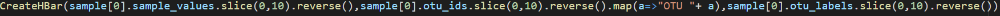

# Plot.ly_challenge - Belly Button Biodiversity

This project built an interactive dashboard to explore the[Belly Button Biodiversity in my Github Pages](https://virginiamwape.github.io/Plotly_Biodiversity_Challenge/), which catalogs the microbes that colonize human navels.

Results, are given by Subject ID and the dataset reveals that a small handful of microbial species (also called operational taxonomic units, or OTUs, in the study) were present in more than 70% of people, while the rest were relatively rare.

## Assignment

1. Use the D3 library to read in `samples.json`.

2. Create a horizontal bar chart with a dropdown menu to display the top 10 OTUs found in that individual.

* Use `sample_values` as the values for the bar chart.

* Use `otu_ids` as the labels for the bar chart.

* Use `otu_labels` as the hovertext for the chart.

3. Create a bubble chart that displays each sample.

* Use `otu_ids` for the x values.

* Use `sample_values` for the y values.

* Use `sample_values` for the marker size.

* Use `otu_ids` for the marker colors.

* Use `otu_labels` for the text values.

4. Display the sample metadata, i.e., an individual's demographic information.

5. Display each key-value pair from the metadata JSON object somewhere on the page.

6. Update all of the plots any time that a new sample is selected.

## Project Steps

### Step 1: Page Layout and Logic
For page layout, I decided to stick with the html that was provided in the StarterCode. I beleive that this is quite an effective layout for a dashboard and it provides proper spacing for each figure.

The javascript logic is what took me the most time. After realizing that the page needs a "master function" that calls in the data and updates all of the charts, the project became a little easier.

#### Code Layout
The first thing that happens is a call to the json data which is used to populate the dropdown. Once that is populated, the optionChanged function is called. This function also connects to the json, but for different data, it then uses that data to run the other 4 functions that populate the bar chart, gauge chart, Demographic Info div, and the bubble chart. This function is also called in the html whenever the value of the dropdown is changed.

### Step 2: Bar Chart

  

The code for the bar chart is extremely simple, with no manipulation at all. It is a generic plotly horizontal bar chart. The 'text' parameter is used for adding text to the labels on hover.

  

The interesting bits are done in the optionChange function where the data is passed into the CreateHBar function.

  

The first step of the optionChange function (not seen in the image) is to reduce the json with the filter function to only show the sample for the currently selected ID. This code that calls the CreateHBar function takes advantage of the fact that the data is listed from largest values to smallest values for each sample. Thus we take the first 10 with slice and reverse the order.

### Step 3: Gauge Chart

  

The code for the gauge chart requires some customization. Using 'steps' I was able to color each segment of the gauge so there is a visible difference at each step. This is the easiest plot to understand, but required the most nuanced code of the dashboard. 

  

### Step 4: Bubble Chart

  

In all honesty, a bubble chart is simply a bad way to represent the data that is being shown here. A lollipop chart or a bar chart are definitely better options, but this is what the challenge asked for. The plot is only showing 2 variables: ID and value. A bubble chart would be suited for showing 4 values, color could be a few categories and size should show something else. A graphic does not need this many colors on it, maybe 10 max for humans to look at it, but ideally less. Either way, the code for the chart can be seen below.

  

### Step 5: Demographics

  

Each time the dropdown is updated, this is called and it lists the json data for the selected sample's metadata and replaces the old list with the new data.

  

### Using the Final Application
The application can be reached at <(https://virginiamwape.github.io/Plotly_Biodiversity_Challenge/)> and is hosted on Github Pages. When opening the dashboard, you see a view like this:

  

You are then able to scroll down for the full dashboard view that includes the bubble chart:

  

The application is quite simple to use from there, select the Subject ID that you want to analyze in the dropdown and all of the charts and demographic info will populate with the proper data.

## Tools

## Step 2: Advanced Challenge Assignment (Optional)

The following task was advanced and therefore...SO MUCH FUN!

* I adapted the Gauge Chart from <https://plot.ly/javascript/gauge-charts/> to plot the weekly washing frequency of the individual.

* Then, I modified the example gauge code to account for values ranging from 0 through 9.

* Update the chart whenever a new sample is selected.

## Deployment

* Deploy my app to a free static page hosting service, GitHub Pages.

## Tools and sources

* Plot.ly
* Javascript
* HTML
* D3.js
* JSON
* GitHub and GitHub Pages
* console.log

* Refered to the [Plotly.js documentation](https://plot.ly/javascript/) when building my plots.

* Also refered to other key sources such as  [A customizable D3 gauge](https://oliverbinns.com/articles/D3js-gauge/)

 [Plotly Custom Data](https://www.youtube.com/watch?v=7WkTbPzamaA)

 [Plotly Bar chart](https://www.youtube.com/watch?v=N1GwQNatOwo)

 [Plotly Real time chart](https://www.youtube.com/watch?v=2-tnkzG0sKU&t=4s)

## Project Steps

### Step 1: Page Layout and Logic
For page layout, I decided to stick with the html that was provided in the StarterCode. I beleive that this is quite an effective layout for a dashboard and it provides proper spacing for each figure.

The javascript logic is what took me the most time. After realizing that the page needs a "master function" that calls in the data and updates all of the charts, the project became a little easier.

#### Code Layout
The first thing that happens is a call to the json data which is used to populate the dropdown. Once that is populated, the optionChanged function is called. This function also connects to the json, but for different data, it then uses that data to run the other 4 functions that populate the bar chart, gauge chart, Demographic Info div, and the bubble chart. This function is also called in the html whenever the value of the dropdown is changed.

## Author

* **Virginia MWape** - **[My github](https://github.com/VirginiaMwape/ "GitHub for Virginia MWape")**

## Acknowledgments

Hulcr, J. et al.(2012) _A Jungle in There: Bacteria in Belly Buttons are Highly Diverse, but Predictable_. Retrieved from: [http://robdunnlab.com/projects/belly-button-biodiversity/results-and-data/](http://robdunnlab.com/projects/belly-button-biodiversity/results-and-data/)

## Copyright

Copyright:copyright: 2022. All Rights Reserved.

---

