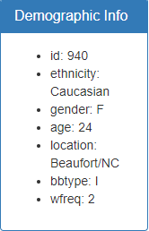

# Plotly Challenge - Belly Button Biodiversity

## Summary

In this project, an interactive dashboard was built to explore the [Belly Button Biodiversity dataset](http://robdunnlab.com/projects/belly-button-biodiversity/), which catalogs the microbes that colonize human navels. The final application is hosted on Github Pages at <https://virginiamwape.github.io/Plotly_Biodiversity_Challenge/>.

The dataset revealed that a small handful of microbial species (also called operational taxonomic units, or OTUs) were present in more than 70% of people, while the rest were relatively rare. The dashboard includes a gauge chart, bubble chart, horizontal bar chart, and a summary of the metadata.

### Using the Final Application
The application can be reached at <https://virginiamwape.github.io/Plotly_Biodiversity_Challenge/> and is hosted on Github Pages.
  

Scroll down for the full dashboard view that includes the bubble chart:

  

Select the Subject ID that you want to analyze in the dropdown and all of the charts and demographic info will populate with the proper data.

## Tools
These are the tools, techniques, and resources used in this project.

* Plotly is used in combination with D3 and Javascript to generate the plots

* HTML is used for the framework of the page

* Github Pages is used to host the data and final application

* The data is stored in JSON format and imported in

### About the Data

Hulcr, J. et al.(2012) _A Jungle in There: Bacteria in Belly Buttons are Highly Diverse, but Predictable_. Retrieved from: [http://robdunnlab.com/projects/belly-button-biodiversity/results-and-data/](http://robdunnlab.com/projects/belly-button-biodiversity/results-and-data/)

## Project Steps

### Step 1: Page Layout and Logic
This page layout used the provided StarterCode which provided a proper spacing for each figure, therefore effective.

#### Code Layout
The dropdown was populated and the optionChanged function is called. This function connects to the json for different data, it then uses that data to run the other 4 functions that populate the bar chart, gauge chart, Demographic Info div, and the bubble chart. 

### Step 2: Bar Chart

  

This is a generic plotly horizontal bar chart. 

  

  

 Using 'steps' each segment of the gauge was coloured so there is a visible difference at each step. 
  

### Step 4: Bubble Chart

  

The code for the chart can be seen below.

  

### Step 5: Demographics

  
  
Each time the dropdown is updated, this is called and it lists the json data for the selected sample's metadata and replaces the old list with the new data.

  

## Author

* **Virginia MWape** - **[My github](https://github.com/VirginiaMwape/ "GitHub for Virginia MWape")**

## Acknowledgments

Hulcr, J. et al.(2012) _A Jungle in There: Bacteria in Belly Buttons are Highly Diverse, but Predictable_. Retrieved from: [http://robdunnlab.com/projects/belly-button-biodiversity/results-and-data/](http://robdunnlab.com/projects/belly-button-biodiversity/results-and-data/)

## Copyright

Copyright:copyright: 2022. All Rights Reserved.
